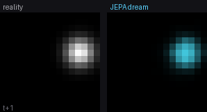
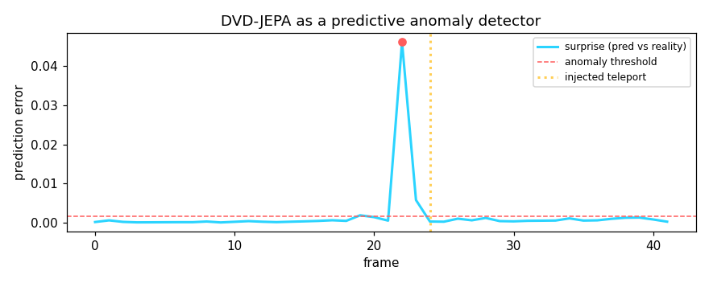
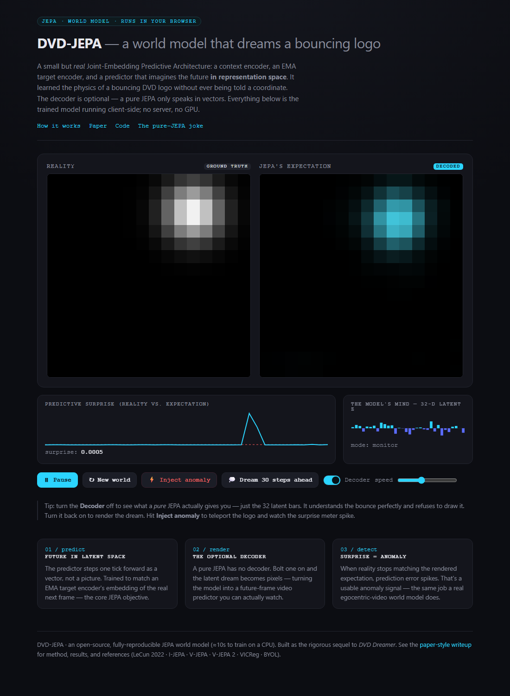

<div align="center">

# DVD-JEPA

### A tiny, fully-reproducible **Joint-Embedding Predictive Architecture** world model — that learns the physics of a bouncing DVD logo in representation space, dreams its future, and detects anomalies. Trains on a **CPU in ~10 seconds**.

[](https://dvd-jepa.vercel.app)
[](https://colab.research.google.com/github/mandarwagh9/dvd-jepa/blob/main/notebooks/dvd_jepa.ipynb)
[](LICENSE)




*Left: reality. Right: the model's dream — rolled forward purely in latent space and decoded to pixels.*

</div>

---

## Abstract

Most attempts to learn a **world model** from video try to predict the next frame pixel-by-pixel, and drown in detail that is fundamentally unpredictable. **JEPA** (Joint-Embedding Predictive Architecture, [LeCun 2022](#references)) makes a different bet: predict the *representation* of the future, not the pixels, and let the encoder discard whatever it cannot predict.

**DVD-JEPA** is the smallest honest demonstration of that idea we could build. The "world" is a DVD logo bouncing in a 16×16 box. A context encoder, an EMA target encoder, and a latent predictor are trained — with no labels and no decoder — to predict the next observation **in a 32-dimensional representation space**. We then show three things:

1. **It learned the world.** A linear probe recovers the logo's exact (y, x) position from the frozen 32-d latent to within **0.73 px** — though it was never given a coordinate.
2. **It can dream (once you add a decoder).** Bolt an optional decoder onto the frozen latents and roll the predictor forward: it renders a correct **future-frame video** of the bounce, including wall reflections, for ~20 steps before latent drift sets in.
3. **It is useful.** Run it as a 1-step predictive monitor and the prediction error becomes an **anomaly signal**: inject a teleport and surprise spikes **88×** over baseline, on the right frame.

The whole thing runs **client-side in your browser** at [dvd-jepa.vercel.app](https://dvd-jepa.vercel.app) — the trained MLPs are re-implemented in ~40 lines of JavaScript. It is a joke and it is also a correct, working instance of the architecture behind I-JEPA, V-JEPA, and V-JEPA 2.

## The idea in one picture

```
            ┌──────────────────────── trained without labels, without a decoder ───────────────────────┐
            │                                                                                            │
 obs_t  ──▶ │ Encoder Eθ ─▶ z_t ──▶ Predictor P ─▶ ẑ_{t+1} ─────────────▶  ‖ ẑ_{t+1} − sg(z̄_{t+1}) ‖²  │ ◀── loss is in
 (2 frames) │                                                              ▲   (prediction in latent      │     LATENT space,
            │ obs_{t+1} ─▶ Encoder E_ema (EMA, stop-grad) ─▶ z̄_{t+1} ──────┘    space, never pixels)       │     never pixels
            └────────────────────────────────────────────────────────────────────────────────────────────┘
                                              │  + VICReg variance term  →  no representation collapse
                                              ▼
        (optional, separate) Decoder D : z → 16×16 frame      ←  the "sellout" that makes the dream visible & useful
```

## Why a bouncing logo?

It is the simplest system that still has the property that matters: **the future is unreadable from a single frame** (you can't tell which way a static dot is going), but **perfectly predictable from two** (position + velocity → the entire deterministic future, bounces included). So a context of two stacked frames is necessary and sufficient — exactly the spatio-temporal setup real video JEPAs use, minus a million hours of internet video.

## Method

| Component | Shape | Role |
|---|---|---|
| **Context encoder** `Eθ` | `2·16·16 → 256 → 128 → 32` | encodes an observation (2 stacked frames) to a latent |
| **Target encoder** `E_ema` | same, EMA of `Eθ`, stop-grad | produces the prediction target — the anti-collapse asymmetry |
| **Predictor** `P` | `32 → 64 → 32` | **the world model**: one step forward in latent space |
| **Decoder** `D` *(optional)* | `32 → 64 → 256 → 256` | readout to pixels; a *pure* JEPA omits this |

**Training objective.** Minimise the latent prediction error plus a variance term:

```
L = ‖ P(Eθ(obs_t)) − sg(E_ema(obs_{t+1})) ‖²   +   Σ_d relu(1 − std(z_d))
       └──────── predict the future in representation space ────────┘     └─ VICReg anti-collapse ─┘
```

The target encoder is an exponential moving average (`τ = 0.99`) of the online encoder with a stop-gradient — the [BYOL](#references) trick. Without the variance term the embedding std starts at **0.007** (collapsing to a constant); with it, std holds at **~2.4–3.0** throughout. The decoder is trained *separately* on the frozen encoder, so the JEPA does all the understanding and the decoder is only a readout.

## Results

All numbers are produced by `python -m dvd_jepa.train` (seed 0, CPU, ~10 s) and saved to [`assets/metrics.json`](assets/metrics.json).

| Result | Value | What it shows |
|---|---:|---|
| Linear-probe position RMSE | **0.73 px** (box is 16 px) | the 32-d latent secretly encodes exact world state |
| Forecast MSE, 1 step ahead | **0.0005** | near-perfect short-horizon prediction |
| Forecast MSE, 30 steps ahead | **0.028** | graceful latent-rollout drift, not collapse |
| Anomaly peak / baseline | **88×** | a teleport is detected via prediction error… |
| Anomaly detected at frame | **22** (injected at 24) | …on the correct frame (2 early: the monitor looks 2 ahead) |
| Embedding std (collapse check) | **~3.0** (not 0) | the representation never collapsed |

<div align="center">

</div>

## Try it — interactive demo

**▶ [dvd-jepa.vercel.app](https://dvd-jepa.vercel.app)** — the trained model running entirely in your browser (no server, no GPU). Things to do:

- **Toggle the decoder off.** This is the *pure JEPA*. It understands the bounce perfectly and gives you nothing but 32 latent bars — it literally cannot draw. Toggle it back on and the dream renders. This is the whole joke, made interactive.
- **Inject an anomaly.** Teleport the logo and watch the surprise meter spike past the threshold.
- **Dream 30 steps ahead.** Freeze reality and let the predictor roll forward on its own — watch it imagine the future, then slowly drift.

<div align="center"></div>

## Reproduce

```bash
git clone https://github.com/mandarwagh9/dvd-jepa
cd dvd-jepa
pip install -r requirements.txt

python -m dvd_jepa.train      # trains everything, writes checkpoints/, web/weights.json, assets/
python scripts/pure_jepa.py   # the original no-decoder version: prints the ASCII latent dream
```

To run the browser demo locally (ES modules need a server, not `file://`):

```bash
cd web && python -m http.server 8000   # then open http://localhost:8000
```

Or **[open the Colab notebook](https://colab.research.google.com/github/mandarwagh9/dvd-jepa/blob/main/notebooks/dvd_jepa.ipynb)** and run it cell by cell.

## Repository layout

```
dvd_jepa/            the package
  world.py           the bouncing-logo environment + observation pairs
  models.py          Encoder, Predictor, Decoder, variance term
  train.py           train, evaluate, export browser weights, render assets
web/                 the client-side interactive demo (index.html + jepa.js + weights.json)
scripts/pure_jepa.py the original decoder-free "it only does vectors" version
notebooks/           Colab notebook
assets/              rendered gif/png + metrics.json
checkpoints/         trained PyTorch weights
```

## How this relates to real systems

DVD-JEPA is a toy, but every moving part has a full-scale counterpart:

- **I-JEPA** (images) and **V-JEPA / V-JEPA 2** (video) use exactly this predict-in-representation-space objective with an EMA target encoder, at ViT scale on real data.
- **V-JEPA 2-AC** makes the predictor *action-conditioned* and plans a real robot in latent space — the same "imagine the future, pick the best" loop, with actions added.
- The two capabilities shown here — **forecast the next frames** and **flag when reality diverges from the forecast** — are exactly what a world model contributes to an egocentric-video data pipeline: predict what the person does next, and auto-surface the unexpected moment.

## Limitations (honest)

- **Latent rollout drifts** after ~20 steps: the predictor is trained for a single step, so errors compound. Multi-step rollout training or a recurrent predictor would extend the horizon.
- **It's 16×16 and deterministic.** There is no stochastic latent `z` for multi-modal futures (real JEPAs add one) because the bouncing logo has exactly one future.
- **The decoder is a crutch.** A pure JEPA has none; we add it only to *visualise* and to compute a pixel-space surprise score.

## References

1. Y. LeCun. *A Path Towards Autonomous Machine Intelligence.* 2022.
2. M. Assran et al. *Self-Supervised Learning from Images with a Joint-Embedding Predictive Architecture (I-JEPA).* CVPR 2023.
3. A. Bardes et al. *Revisiting Feature Prediction for Learning Visual Representations from Video (V-JEPA).* 2024.
4. Meta AI. *V-JEPA 2: Self-Supervised Video Models Enable Understanding, Prediction and Planning.* 2025.
5. A. Bardes, J. Ponce, Y. LeCun. *VICReg: Variance-Invariance-Covariance Regularization for Self-Supervised Learning.* ICLR 2022.
6. J.-B. Grill et al. *Bootstrap Your Own Latent (BYOL).* NeurIPS 2020.

## Citation

```bibtex
@software{dvdjepa2026,
  title  = {DVD-JEPA: a tiny reproducible JEPA world model of a bouncing logo},
  author = {Wagh, Mandar},
  year   = {2026},
  url    = {https://github.com/mandarwagh9/dvd-jepa}
}
```

## License

MIT — see [LICENSE](LICENSE). Built as the rigorous sequel to *DVD Dreamer*.
